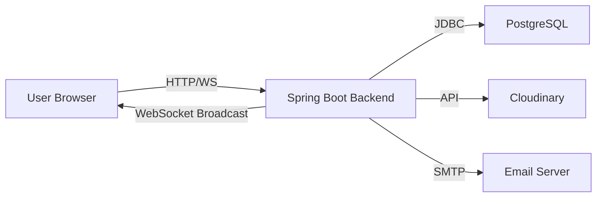

# ByteChat - Complete Application Documentation

## Table of Contents
1. [Executive Summary](#executive-summary)
2. [System Architecture](#system-architecture)
3. [Technology Stack](#technology-stack)
4. [Core Features & Functionalities](#core-features--functionalities)
5. [Data Model & Database Schema](#data-model--database-schema)
6. [Backend Architecture](#backend-architecture)
7. [Frontend Architecture](#frontend-architecture)
8. [API Documentation](#api-documentation)
9. [Real-time Communication](#real-time-communication)
10. [Security & Authentication](#security--authentication)
11. [User Flows & Journeys](#user-flows--journeys)
12. [Deployment & Infrastructure](#deployment--infrastructure)
13. [Testing Strategy](#testing-strategy)
14. [Performance Considerations](#performance-considerations)

---

## Executive Summary

ByteChat is a modern, full-stack real-time communication platform inspired by Slack. It enables teams to collaborate through workspaces, channels, and direct messaging with real-time updates powered by WebSocket technology.

### Key Highlights
- **Type**: Real-time Team Collaboration Platform
- **Architecture**: Client-Server with WebSocket support
- **Backend**: Spring Boot 3.2 (Java 21)
- **Frontend**: React 18 with Vite
- **Database**: PostgreSQL
- **Real-time**: STOMP over WebSocket (SockJS fallback)
- **Authentication**: JWT-based with OTP verification
- **File Storage**: Cloudinary for media, Local for documents

---

## System Architecture

### High-Level Architecture

```
┌─────────────────────────────────────────────────────────────┐
│                     CLIENT LAYER                             │
│  ┌──────────────────────────────────────────────────────┐  │
│  │  React Application (Vite)                            │  │
│  │  - UI Components (Tailwind CSS 4)                    │  │
│  │  - State Management (Zustand)                        │  │
│  │  - Data Fetching (React Query)                       │  │
│  │  - WebSocket Client (StompJS/SockJS)                 │  │
│  └──────────────────────────────────────────────────────┘  │
└─────────────────────────────────────────────────────────────┘
                            ↕ HTTP/WebSocket
┌─────────────────────────────────────────────────────────────┐
│                     SERVER LAYER                             │
│  ┌──────────────────────────────────────────────────────┐  │
│  │  Spring Boot Application                             │  │
│  │  - REST Controllers (HTTP APIs)                      │  │
│  │  - WebSocket Message Broker (STOMP)                  │  │
│  │  - Security Layer (JWT + Spring Security)            │  │
│  │  - Service Layer (Business Logic)                    │  │
│  │  - Repository Layer (Data Access)                    │  │
│  └──────────────────────────────────────────────────────┘  │
└─────────────────────────────────────────────────────────────┘
                            ↕
┌─────────────────────────────────────────────────────────────┐
│                  PERSISTENCE & EXTERNAL                      │
│  ┌──────────────┐  ┌──────────────┐  ┌──────────────┐     │
│  │  PostgreSQL  │  │  Cloudinary  │  │  SMTP Server │     │
│  │   Database   │  │ File Storage │  │    (Email)   │     │
│  └──────────────┘  └──────────────┘  └──────────────┘     │
└─────────────────────────────────────────────────────────────┘
```

### Component Interaction Flow



---

## Technology Stack

### Frontend Technologies
| Technology | Version | Purpose |
|------------|---------|---------|
| React | 18.x | UI Framework |
| Vite | Latest | Build Tool & Dev Server |
| Tailwind CSS | 4.x | Styling Framework |
| Zustand | Latest | State Management |
| React Query (TanStack) | Latest | Server State Management |
| React Router DOM | Latest | Client-side Routing |
| Axios | Latest | HTTP Client |
| StompJS | Latest | WebSocket Protocol |
| SockJS Client | Latest | WebSocket Fallback |
| Lucide React | Latest | Icon Library |
| date-fns | Latest | Date Formatting |
| emoji-picker-react | Latest | Emoji Support |

### Backend Technologies
| Technology | Version | Purpose |
|------------|---------|---------|
| Spring Boot | 3.2.x | Application Framework |
| Java | 21 | Programming Language |
| Spring Security | 6.x | Security Framework |
| Spring Data JPA | 3.x | Data Access Layer |
| Spring WebSocket | 6.x | WebSocket Support |
| PostgreSQL | 15 | Relational Database |
| Flyway | Latest | Database Migrations |
| JWT (jjwt) | 0.12.x | Token Authentication |
| Cloudinary | Latest | Cloud File Storage |
| JavaMail | Latest | Email Service |
| SpringDoc OpenAPI | 2.x | API Documentation |
| Lombok | Latest | Code Generation |
| JUnit 5 | Latest | Testing Framework |
| Mockito | Latest | Mocking Framework |

### DevOps & Infrastructure
| Technology | Purpose |
|------------|---------|
| Docker | Containerization |
| Docker Compose | Multi-container Orchestration |
| Maven | Build Tool (Backend) |
| npm | Package Manager (Frontend) |
| Nginx | Web Server (Production) |

---

## Core Features & Functionalities

### 1. User Authentication & Authorization


#### Features:
- **OTP-based Registration**: Email verification using one-time passwords
- **JWT Authentication**: Stateless token-based authentication
- **Refresh Token Support**: Automatic token renewal
- **Role-Based Access Control**: User, Admin, and Owner roles
- **Session Management**: Secure session handling

#### Authentication Flow:
1. User registers with email
2. System generates and sends OTP via email
3. User verifies OTP
4. System issues JWT access token and refresh token
5. Client stores tokens and includes in subsequent requests
6. Backend validates JWT on each protected endpoint

### 2. Workspace Management

#### Features:
- **Multi-Workspace Support**: Users can belong to multiple workspaces
- **Workspace Creation**: Any authenticated user can create workspaces
- **Member Invitation**: Invite users via email
- **Role Management**: Owner, Admin, Member roles
- **Workspace Settings**: Name, description, avatar customization

#### Workspace Roles:
- **OWNER**: Full control, can delete workspace
- **ADMIN**: Manage members, channels, settings
- **MEMBER**: Basic access to channels and messaging

### 3. Channel Communication

#### Features:
- **Public Channels**: Open to all workspace members
- **Private Channels**: Invitation-only channels
- **Channel Creation**: Members can create channels
- **Channel Management**: Edit, delete, archive channels
- **Member Management**: Add/remove channel members
- **Channel Roles**: Admin and Member roles

#### Channel Types:
- **Public**: Visible and joinable by all workspace members
- **Private**: Hidden, invitation-only access

### 4. Real-time Messaging

#### Features:
- **Instant Message Delivery**: WebSocket-based real-time updates
- **Message Types**: Text, files, images, videos, voice notes
- **Rich Text Support**: Markdown formatting
- **Message Actions**: Edit, delete, pin messages
- **Emoji Reactions**: React to messages with emojis
- **Message Threading**: Reply to specific messages
- **Typing Indicators**: See when others are typing
- **Read Receipts**: Track message read status
- **Unread Badges**: Visual indicators for unread messages

### 5. Direct Messaging (DM)

#### Features:
- **One-on-One Chat**: Private conversations between users
- **DM Requests**: Request-based DM initiation
- **DM Groups**: Multi-user private conversations
- **All Messaging Features**: Same capabilities as channel messages

#### DM Request Flow:
1. User sends DM request to another user
2. Recipient receives notification
3. Recipient accepts or rejects request
4. Upon acceptance, DM conversation is created

### 6. File Sharing & Attachments

#### Features:
- **Multiple File Types**: Images, videos, documents, audio
- **Cloud Storage**: Cloudinary for media files
- **Local Storage**: Documents stored locally
- **File Preview**: In-app preview for images and PDFs
- **Download Support**: Download any attached file
- **Voice Notes**: Record and send voice messages

#### Supported File Types:
- Images: JPG, PNG, GIF, WebP
- Videos: MP4, WebM, AVI
- Documents: PDF, DOCX, XLSX, TXT
- Audio: MP3, WAV, WebM (voice notes)

### 7. Meetings & Video Calls

#### Features:
- **Meeting Creation**: Start meetings from channels or DMs
- **Meeting Invitations**: Invite specific users
- **Meeting Notifications**: Real-time meeting alerts
- **Meeting Status**: Track active/ended meetings
- **Meeting History**: View past meetings

### 8. Notifications System

#### Features:
- **Real-time Notifications**: Instant WebSocket delivery
- **Notification Types**: 
  - Workspace invitations
  - Channel invitations
  - Meeting invitations
  - Mentions (@user)
  - DM requests
  - Message replies
- **Notification Center**: Centralized notification view
- **Mark as Read**: Individual or bulk mark as read
- **Notification Badges**: Unread count indicators

### 9. User Presence & Status

#### Features:
- **Online/Offline Status**: Real-time presence tracking
- **Last Seen**: Track when users were last active
- **Presence Indicators**: Visual status indicators
- **Automatic Status Updates**: Based on WebSocket connection

### 10. Search & Discovery

#### Features:
- **User Search**: Find users across workspaces
- **Channel Search**: Discover public channels
- **Message Search**: Search within conversations
- **Workspace Discovery**: Browse available workspaces

### 11. Profile Management

#### Features:
- **Profile Customization**: Name, avatar, bio
- **Avatar Upload**: Cloudinary-hosted profile pictures
- **Email Management**: Update email address
- **Password Management**: Change password
- **Account Settings**: Privacy and notification preferences

---

## Data Model & Database Schema

### Entity Relationship Overview

```
USER ←→ WORKSPACE_MEMBER ←→ WORKSPACE
  ↓                              ↓
  ↓                          CHANNEL
  ↓                              ↓
  ↓                      CHANNEL_MEMBER
  ↓                              ↓
  ↓                          MESSAGE
  ↓                              ↓
  ↓                         REACTION
  ↓                              ↓
  ↓                        ATTACHMENT
  ↓
  ↓→ DIRECT_MESSAGE
  ↓→ NOTIFICATION
  ↓→ MEETING
  ↓→ OTP
```

### Core Entities

#### 1. User Entity
```java
@Entity
@Table(name = "users")
public class User {
    @Id @GeneratedValue
    private Long id;
    
    @Column(unique = true, nullable = false)
    private String email;
    
    private String displayName;
    private String avatarUrl;
    private String bio;
    
    @Enumerated(EnumType.STRING)
    private Role role; // USER, ADMIN
    
    private Boolean isOnline;
    private LocalDateTime lastSeen;
    
    @CreationTimestamp
    private LocalDateTime createdAt;
    
    @UpdateTimestamp
    private LocalDateTime updatedAt;
}
```

#### 2. Workspace Entity
```java
@Entity
@Table(name = "workspaces")
public class Workspace {
    @Id @GeneratedValue
    private Long id;
    
    @Column(nullable = false)
    private String name;
    
    private String description;
    private String avatarUrl;
    
    @ManyToOne
    @JoinColumn(name = "owner_id")
    private User owner;
    
    @CreationTimestamp
    private LocalDateTime createdAt;
}
```

#### 3. Channel Entity
```java
@Entity
@Table(name = "channels")
public class Channel {
    @Id @GeneratedValue
    private Long id;
    
    @Column(nullable = false)
    private String name;
    
    private String description;
    private Boolean isPrivate;
    
    @ManyToOne
    @JoinColumn(name = "workspace_id")
    private Workspace workspace;
    
    @ManyToOne
    @JoinColumn(name = "created_by")
    private User createdBy;
    
    @CreationTimestamp
    private LocalDateTime createdAt;
}
```

#### 4. Message Entity
```java
@Entity
@Table(name = "messages")
public class Message {
    @Id @GeneratedValue
    private Long id;
    
    @Column(columnDefinition = "TEXT")
    private String content;
    
    @ManyToOne
    @JoinColumn(name = "channel_id")
    private Channel channel;
    
    @ManyToOne
    @JoinColumn(name = "sender_id")
    private User sender;
    
    @ManyToOne
    @JoinColumn(name = "parent_message_id")
    private Message parentMessage; // For threading
    
    private Boolean isPinned;
    private Boolean isEdited;
    
    @CreationTimestamp
    private LocalDateTime createdAt;
    
    @UpdateTimestamp
    private LocalDateTime updatedAt;
}
```

#### 5. DirectMessage Entity
```java
@Entity
@Table(name = "direct_messages")
public class DirectMessage {
    @Id @GeneratedValue
    private Long id;
    
    @Column(columnDefinition = "TEXT")
    private String content;
    
    @ManyToOne
    @JoinColumn(name = "sender_id")
    private User sender;
    
    @ManyToOne
    @JoinColumn(name = "receiver_id")
    private User receiver;
    
    private Boolean isRead;
    
    @CreationTimestamp
    private LocalDateTime createdAt;
}
```

#### 6. Notification Entity
```java
@Entity
@Table(name = "notifications")
public class Notification {
    @Id @GeneratedValue
    private Long id;
    
    @ManyToOne
    @JoinColumn(name = "user_id")
    private User user;
    
    private String type; // MENTION, INVITE, DM_REQUEST, etc.
    private String message;
    private String referenceId;
    
    private Boolean isRead;
    
    @CreationTimestamp
    private LocalDateTime createdAt;
}
```

### Database Relationships

#### One-to-Many Relationships:
- User → WorkspaceMember (One user can be in many workspaces)
- Workspace → Channel (One workspace has many channels)
- Channel → Message (One channel has many messages)
- User → Message (One user sends many messages)
- Message → Reaction (One message has many reactions)
- Message → Attachment (One message has many attachments)

#### Many-to-Many Relationships:
- User ←→ Workspace (through WorkspaceMember)
- User ←→ Channel (through ChannelMember)
- User ←→ Meeting (through meeting participants)

### Database Indexes

Key indexes for performance:
- `users.email` (unique index)
- `messages.channel_id` (for channel message queries)
- `messages.created_at` (for chronological ordering)
- `direct_messages.sender_id, receiver_id` (for DM queries)
- `notifications.user_id, is_read` (for notification queries)
- `workspace_members.user_id, workspace_id` (for membership queries)

---

## Backend Architecture

### Package Structure

```
com.bytechat
├── config/                    # Configuration classes
│   ├── SecurityConfig.java
│   ├── WebSocketConfig.java
│   ├── JwtService.java
│   ├── CorsConfig.java
│   └── CloudinaryConfig.java
├── controllers/               # REST & WebSocket controllers
│   ├── AuthController.java
│   ├── WorkspaceController.java
│   ├── ChannelController.java
│   ├── MessageController.java
│   ├── DirectMessageController.java
│   ├── NotificationController.java
│   ├── UserController.java
│   ├── MeetingController.java
│   └── ChatWebSocketController.java
├── services/                  # Service interfaces
│   ├── AuthService.java
│   ├── WorkspaceService.java
│   ├── ChannelService.java
│   ├── MessageService.java
│   └── ...
├── serviceimpl/              # Service implementations
│   ├── AuthServiceImpl.java
│   ├── WorkspaceServiceImpl.java
│   ├── MessageServiceImpl.java
│   ├── EmailServiceImpl.java
│   ├── CloudinaryServiceImpl.java
│   └── ...
├── repository/               # Data access layer
│   ├── UserRepository.java
│   ├── WorkspaceRepository.java
│   ├── ChannelRepository.java
│   ├── MessageRepository.java
│   └── ...
├── entity/                   # JPA entities
│   ├── User.java
│   ├── Workspace.java
│   ├── Channel.java
│   ├── Message.java
│   └── ...
├── dto/                      # Data Transfer Objects
│   ├── request/
│   └── response/
├── exception/                # Custom exceptions
│   ├── GlobalExceptionHandler.java
│   ├── ResourceNotFoundException.java
│   └── UnauthorizedException.java
└── util/                     # Utility classes
    └── SecurityUtils.java
```

### Layered Architecture

```
┌─────────────────────────────────────┐
│     Controller Layer                │
│  (REST & WebSocket Endpoints)       │
└─────────────────────────────────────┘
              ↓
┌─────────────────────────────────────┐
│     Service Layer                   │
│  (Business Logic)                   │
└─────────────────────────────────────┘
              ↓
┌─────────────────────────────────────┐
│     Repository Layer                │
│  (Data Access)                      │
└─────────────────────────────────────┘
              ↓
┌─────────────────────────────────────┐
│     Database (PostgreSQL)           │
└─────────────────────────────────────┘
```

### Key Backend Components

#### 1. Security Configuration
- JWT-based authentication
- Stateless session management
- CORS configuration for frontend
- WebSocket authentication interceptor
- Password encoding with BCrypt

#### 2. WebSocket Configuration
- STOMP protocol over WebSocket
- SockJS fallback support
- Message broker for pub/sub
- Authentication channel interceptor
- Connection event listeners

#### 3. Service Layer Responsibilities

**AuthServiceImpl**:
- User registration and login
- OTP generation and validation
- JWT token generation
- Token refresh logic

**MessageServiceImpl**:
- Message creation and persistence
- Message editing and deletion
- WebSocket message broadcasting
- Message read tracking

**WorkspaceServiceImpl**:
- Workspace CRUD operations
- Member management
- Invitation handling
- Permission validation

**ChannelServiceImpl**:
- Channel CRUD operations
- Member management
- Public/private channel logic
- Channel invitation handling

**NotificationServiceImpl**:
- Notification creation
- Real-time notification delivery
- Notification read status
- Notification filtering

**PresenceServiceImpl**:
- Online/offline status tracking
- Last seen updates
- Presence broadcasting

**EmailServiceImpl**:
- OTP email sending
- Invitation emails
- SMTP configuration

**CloudinaryServiceImpl**:
- Image upload to Cloudinary
- Avatar management
- Media file handling

**FileStorageServiceImpl**:
- Local file storage
- Document handling
- File retrieval

---

## Frontend Architecture

### Project Structure

```
frontend/src/
├── assets/                   # Static assets
│   └── logo.png
├── components/               # React components
│   ├── Chat/
│   │   ├── MessageList.jsx
│   │   ├── MessageInput.jsx
│   │   ├── MessageItem.jsx
│   │   └── EmojiPicker.jsx
│   ├── Sidebar/
│   │   ├── WorkspaceSidebar.jsx
│   │   ├── ChannelList.jsx
│   │   └── DMList.jsx
│   ├── Workspaces/
│   │   ├── WorkspaceCard.jsx
│   │   └── CreateWorkspace.jsx
│   ├── Profile/
│   │   └── ProfileSettings.jsx
│   ├── Meetings/
│   │   └── MeetingRoom.jsx
│   ├── Common/
│   │   ├── Modal.jsx
│   │   ├── Button.jsx
│   │   └── Input.jsx
│   └── Shared/
│       ├── Navbar.jsx
│       └── Toast.jsx
├── pages/                    # Page components
│   ├── LoginPage.jsx
│   ├── RegisterPage.jsx
│   ├── LandingPage.jsx
│   ├── ChatPage.jsx
│   ├── ProfilePage.jsx
│   └── WorkspaceWizard.jsx
├── layouts/                  # Layout components
│   └── MainLayout.jsx
├── routes/                   # Routing configuration
│   └── AppRouter.jsx
├── services/                 # API services
│   ├── api.js
│   ├── authService.js
│   ├── workspaceService.js
│   ├── channelService.js
│   ├── chatService.js
│   ├── dmService.js
│   ├── notificationService.js
│   ├── userService.js
│   ├── meetingService.js
│   └── websocket.js
├── store/                    # State management
│   ├── authStore.js
│   ├── chatStore.js
│   └── toastStore.js
├── hooks/                    # Custom React hooks
│   ├── useAuth.js
│   ├── useChat.js
│   └── usePresence.js
├── utils/                    # Utility functions
│   └── formatDate.js
├── App.jsx                   # Root component
├── main.jsx                  # Entry point
└── index.css                 # Global styles
```

### State Management (Zustand)

#### Auth Store
```javascript
const useAuthStore = create((set) => ({
  user: null,
  token: null,
  isAuthenticated: false,
  login: (user, token) => set({ user, token, isAuthenticated: true }),
  logout: () => set({ user: null, token: null, isAuthenticated: false }),
  updateUser: (user) => set({ user })
}));
```

#### Chat Store
```javascript
const useChatStore = create((set) => ({
  currentWorkspace: null,
  currentChannel: null,
  messages: [],
  channels: [],
  directMessages: [],
  setCurrentWorkspace: (workspace) => set({ currentWorkspace: workspace }),
  setCurrentChannel: (channel) => set({ currentChannel: channel }),
  addMessage: (message) => set((state) => ({ 
    messages: [...state.messages, message] 
  })),
  updateMessage: (id, updates) => set((state) => ({
    messages: state.messages.map(m => m.id === id ? {...m, ...updates} : m)
  }))
}));
```

### WebSocket Integration

```javascript
// websocket.js
import { Client } from '@stomp/stompjs';
import SockJS from 'sockjs-client';

class WebSocketService {
  constructor() {
    this.client = null;
    this.connected = false;
  }

  connect(token) {
    const socket = new SockJS('http://localhost:8080/ws');
    this.client = new Client({
      webSocketFactory: () => socket,
      connectHeaders: {
        Authorization: `Bearer ${token}`
      },
      onConnect: () => {
        this.connected = true;
        this.subscribeToChannels();
      },
      onDisconnect: () => {
        this.connected = false;
      }
    });
    this.client.activate();
  }

  subscribeToChannel(channelId, callback) {
    if (this.client && this.connected) {
      this.client.subscribe(`/topic/channel/${channelId}`, (message) => {
        callback(JSON.parse(message.body));
      });
    }
  }

  sendMessage(destination, body) {
    if (this.client && this.connected) {
      this.client.publish({
        destination,
        body: JSON.stringify(body)
      });
    }
  }

  disconnect() {
    if (this.client) {
      this.client.deactivate();
    }
  }
}

export default new WebSocketService();
```

### React Query Integration

```javascript
// Example: Fetching messages
const { data: messages, isLoading } = useQuery({
  queryKey: ['messages', channelId],
  queryFn: () => chatService.getMessages(channelId),
  enabled: !!channelId
});

// Example: Sending message mutation
const sendMessageMutation = useMutation({
  mutationFn: (messageData) => chatService.sendMessage(messageData),
  onSuccess: () => {
    queryClient.invalidateQueries(['messages', channelId]);
  }
});
```

---

## API Documentation

### Authentication Endpoints

#### POST /api/auth/register
Register a new user and send OTP

**Request:**
```json
{
  "email": "user@example.com"
}
```

**Response:**
```json
{
  "message": "OTP sent to email",
  "email": "user@example.com"
}
```

#### POST /api/auth/verify-otp
Verify OTP and complete registration

**Request:**
```json
{
  "email": "user@example.com",
  "otp": "123456"
}
```

**Response:**
```json
{
  "token": "eyJhbGciOiJIUzI1NiIsInR5cCI6IkpXVCJ9...",
  "refreshToken": "refresh_token_here",
  "user": {
    "id": 1,
    "email": "user@example.com",
    "displayName": "User Name",
    "avatarUrl": null,
    "role": "USER"
  }
}
```

#### POST /api/auth/login
Login existing user

**Request:**
```json
{
  "email": "user@example.com"
}
```

**Response:**
```json
{
  "message": "OTP sent to email"
}
```

#### POST /api/auth/refresh
Refresh access token

**Request:**
```json
{
  "refreshToken": "refresh_token_here"
}
```

**Response:**
```json
{
  "token": "new_access_token",
  "refreshToken": "new_refresh_token"
}
```

### Workspace Endpoints

#### GET /api/workspaces
Get all workspaces for current user

**Response:**
```json
[
  {
    "id": 1,
    "name": "My Workspace",
    "description": "Team workspace",
    "avatarUrl": "https://...",
    "owner": {
      "id": 1,
      "displayName": "Owner Name"
    },
    "memberCount": 15,
    "createdAt": "2026-01-01T10:00:00"
  }
]
```

#### POST /api/workspaces
Create new workspace

**Request:**
```json
{
  "name": "New Workspace",
  "description": "Description here"
}
```

**Response:**
```json
{
  "id": 2,
  "name": "New Workspace",
  "description": "Description here",
  "owner": {
    "id": 1,
    "displayName": "Current User"
  },
  "createdAt": "2026-04-06T10:00:00"
}
```

#### GET /api/workspaces/{id}
Get workspace details

**Response:**
```json
{
  "id": 1,
  "name": "My Workspace",
  "description": "Team workspace",
  "avatarUrl": "https://...",
  "owner": {...},
  "members": [...],
  "channels": [...]
}
```

#### PUT /api/workspaces/{id}
Update workspace

**Request:**
```json
{
  "name": "Updated Name",
  "description": "Updated description"
}
```

#### DELETE /api/workspaces/{id}
Delete workspace (owner only)

#### POST /api/workspaces/{id}/invite
Invite user to workspace

**Request:**
```json
{
  "email": "newuser@example.com",
  "role": "MEMBER"
}
```

#### POST /api/workspaces/{id}/members/{userId}/role
Update member role

**Request:**
```json
{
  "role": "ADMIN"
}
```

### Channel Endpoints

#### GET /api/channels/workspace/{workspaceId}
Get all channels in workspace

**Response:**
```json
[
  {
    "id": 1,
    "name": "general",
    "description": "General discussion",
    "isPrivate": false,
    "memberCount": 10,
    "unreadCount": 5,
    "createdAt": "2026-01-01T10:00:00"
  }
]
```

#### POST /api/channels
Create new channel

**Request:**
```json
{
  "workspaceId": 1,
  "name": "project-alpha",
  "description": "Project Alpha discussions",
  "isPrivate": false
}
```

#### GET /api/channels/{id}
Get channel details

#### PUT /api/channels/{id}
Update channel

#### DELETE /api/channels/{id}
Delete channel

#### POST /api/channels/{id}/members
Add member to channel

**Request:**
```json
{
  "userId": 5
}
```

#### DELETE /api/channels/{id}/members/{userId}
Remove member from channel

### Message Endpoints

#### GET /api/messages/channel/{channelId}
Get messages in channel

**Query Parameters:**
- `page`: Page number (default: 0)
- `size`: Page size (default: 50)

**Response:**
```json
{
  "content": [
    {
      "id": 1,
      "content": "Hello everyone!",
      "sender": {
        "id": 1,
        "displayName": "John Doe",
        "avatarUrl": "https://..."
      },
      "channelId": 1,
      "isPinned": false,
      "isEdited": false,
      "reactions": [
        {
          "emoji": "👍",
          "count": 3,
          "users": [...]
        }
      ],
      "attachments": [],
      "createdAt": "2026-04-06T10:00:00",
      "updatedAt": "2026-04-06T10:00:00"
    }
  ],
  "totalPages": 5,
  "totalElements": 250,
  "number": 0
}
```

#### POST /api/messages
Send new message

**Request:**
```json
{
  "channelId": 1,
  "content": "Hello everyone!",
  "parentMessageId": null
}
```

**Response:**
```json
{
  "id": 100,
  "content": "Hello everyone!",
  "sender": {...},
  "channelId": 1,
  "createdAt": "2026-04-06T10:30:00"
}
```

#### PUT /api/messages/{id}
Edit message

**Request:**
```json
{
  "content": "Updated message content"
}
```

#### DELETE /api/messages/{id}
Delete message

#### POST /api/messages/{id}/pin
Pin/unpin message

#### POST /api/messages/{id}/read
Mark message as read

### Direct Message Endpoints

#### GET /api/direct-messages
Get all DM conversations

**Response:**
```json
[
  {
    "id": 1,
    "otherUser": {
      "id": 2,
      "displayName": "Jane Smith",
      "avatarUrl": "https://...",
      "isOnline": true
    },
    "lastMessage": {
      "content": "See you tomorrow!",
      "createdAt": "2026-04-06T09:00:00"
    },
    "unreadCount": 2
  }
]
```

#### GET /api/direct-messages/conversation/{userId}
Get DM conversation with specific user

**Response:**
```json
{
  "messages": [
    {
      "id": 1,
      "content": "Hi there!",
      "sender": {...},
      "receiver": {...},
      "isRead": true,
      "createdAt": "2026-04-06T08:00:00"
    }
  ]
}
```

#### POST /api/direct-messages
Send direct message

**Request:**
```json
{
  "receiverId": 2,
  "content": "Hello!"
}
```

#### POST /api/dm-requests
Send DM request

**Request:**
```json
{
  "receiverId": 5
}
```

#### POST /api/dm-requests/{id}/accept
Accept DM request

#### POST /api/dm-requests/{id}/reject
Reject DM request

### Notification Endpoints

#### GET /api/notifications
Get user notifications

**Response:**
```json
[
  {
    "id": 1,
    "type": "MENTION",
    "message": "John mentioned you in #general",
    "referenceId": "123",
    "isRead": false,
    "createdAt": "2026-04-06T10:00:00"
  }
]
```

#### PUT /api/notifications/{id}/read
Mark notification as read

#### PUT /api/notifications/read-all
Mark all notifications as read

### User Endpoints

#### GET /api/users/me
Get current user profile

**Response:**
```json
{
  "id": 1,
  "email": "user@example.com",
  "displayName": "John Doe",
  "avatarUrl": "https://...",
  "bio": "Software Developer",
  "isOnline": true,
  "lastSeen": "2026-04-06T10:00:00",
  "createdAt": "2026-01-01T10:00:00"
}
```

#### PUT /api/users/me
Update user profile

**Request:**
```json
{
  "displayName": "John Smith",
  "bio": "Senior Developer"
}
```

#### POST /api/users/me/avatar
Upload user avatar

**Request:** multipart/form-data with file

#### GET /api/users/search
Search users

**Query Parameters:**
- `query`: Search term
- `workspaceId`: Filter by workspace (optional)

### File Upload Endpoints

#### POST /api/files/upload
Upload file

**Request:** multipart/form-data
- `file`: File to upload
- `type`: FILE_TYPE (IMAGE, VIDEO, DOCUMENT, AUDIO)

**Response:**
```json
{
  "id": 1,
  "fileName": "document.pdf",
  "fileUrl": "http://localhost:8080/uploads/uuid_document.pdf",
  "fileType": "DOCUMENT",
  "fileSize": 1024000,
  "uploadedAt": "2026-04-06T10:00:00"
}
```

#### GET /api/files/{id}
Download file

### Meeting Endpoints

#### POST /api/meetings
Create meeting

**Request:**
```json
{
  "title": "Team Standup",
  "channelId": 1,
  "participantIds": [2, 3, 4]
}
```

#### GET /api/meetings/{id}
Get meeting details

#### POST /api/meetings/{id}/end
End meeting

#### GET /api/meetings/active
Get active meetings

### WebSocket Endpoints

#### /topic/channel/{channelId}
Subscribe to channel messages

**Message Format:**
```json
{
  "id": 100,
  "content": "New message",
  "sender": {...},
  "channelId": 1,
  "createdAt": "2026-04-06T10:00:00"
}
```

#### /topic/presence
Subscribe to presence updates

**Message Format:**
```json
{
  "userId": 5,
  "isOnline": true,
  "lastSeen": "2026-04-06T10:00:00"
}
```

#### /user/topic/notifications
Subscribe to personal notifications

**Message Format:**
```json
{
  "id": 50,
  "type": "MENTION",
  "message": "You were mentioned",
  "referenceId": "123",
  "createdAt": "2026-04-06T10:00:00"
}
```

#### /app/chat.typing
Send typing indicator

**Message Format:**
```json
{
  "channelId": 1,
  "userId": 1,
  "isTyping": true
}
```

#### /topic/channel/{channelId}/typing
Receive typing indicators

---

## Real-time Communication

### WebSocket Architecture

ByteChat uses STOMP (Simple Text Oriented Messaging Protocol) over WebSocket for real-time bidirectional communication.

#### Connection Flow

```
1. Client initiates WebSocket connection
   ↓
2. SockJS establishes connection (with fallback)
   ↓
3. STOMP handshake with JWT authentication
   ↓
4. Server validates JWT token
   ↓
5. Connection established
   ↓
6. Client subscribes to relevant topics
   ↓
7. Real-time message exchange begins
```

### Message Broadcasting

#### Channel Messages
When a user sends a message:
1. Client sends POST request to `/api/messages`
2. Backend persists message to database
3. Backend broadcasts message to `/topic/channel/{channelId}`
4. All subscribed clients receive the message instantly
5. Clients update UI with new message

#### Direct Messages
1. Client sends POST request to `/api/direct-messages`
2. Backend persists DM to database
3. Backend sends to `/user/{receiverId}/topic/dm`
4. Receiver gets instant notification
5. Sender gets confirmation

#### Presence Updates
1. User connects/disconnects via WebSocket
2. WebSocketEventListener detects connection change
3. PresenceService updates user status
4. Status broadcast to `/topic/presence`
5. All clients update user status indicators

#### Typing Indicators
1. User starts typing in channel
2. Client sends message to `/app/chat.typing`
3. Backend broadcasts to `/topic/channel/{channelId}/typing`
4. Other users see typing indicator
5. Indicator clears after timeout

### WebSocket Configuration

```java
@Configuration
@EnableWebSocketMessageBroker
public class WebSocketConfig implements WebSocketMessageBrokerConfigurer {
    
    @Override
    public void configureMessageBroker(MessageBrokerRegistry config) {
        config.enableSimpleBroker("/topic", "/user");
        config.setApplicationDestinationPrefixes("/app");
        config.setUserDestinationPrefix("/user");
    }
    
    @Override
    public void registerStompEndpoints(StompEndpointRegistry registry) {
        registry.addEndpoint("/ws")
                .setAllowedOriginPatterns("*")
                .withSockJS();
    }
}
```

### Connection Management

#### Heartbeat Mechanism
- Client sends ping every 30 seconds
- Server responds with pong
- Connection considered dead after 3 missed heartbeats
- Automatic reconnection on disconnect

#### Reconnection Strategy
```javascript
const reconnectDelay = 5000; // 5 seconds
let reconnectAttempts = 0;
const maxReconnectAttempts = 10;

function reconnect() {
  if (reconnectAttempts < maxReconnectAttempts) {
    setTimeout(() => {
      reconnectAttempts++;
      connect();
    }, reconnectDelay * reconnectAttempts);
  }
}
```

---

## Security & Authentication

### JWT Authentication

#### Token Structure
```json
{
  "header": {
    "alg": "HS256",
    "typ": "JWT"
  },
  "payload": {
    "sub": "user@example.com",
    "userId": 1,
    "role": "USER",
    "iat": 1712400000,
    "exp": 1712486400
  },
  "signature": "..."
}
```

#### Token Lifecycle
1. **Generation**: Upon successful OTP verification
2. **Storage**: Client stores in localStorage/sessionStorage
3. **Usage**: Included in Authorization header for all requests
4. **Validation**: Backend validates on each protected endpoint
5. **Refresh**: Automatic refresh before expiration
6. **Expiration**: Access token expires after 24 hours

### Security Measures

#### 1. Password Security
- No passwords stored (OTP-based authentication)
- OTP expires after 10 minutes
- OTP can only be used once
- Rate limiting on OTP requests

#### 2. API Security
- All endpoints except auth require JWT
- Role-based access control (RBAC)
- CORS configured for specific origins
- CSRF protection enabled
- SQL injection prevention via JPA

#### 3. WebSocket Security
- JWT validation on WebSocket connection
- Channel interceptor validates authentication
- User can only subscribe to authorized channels
- Message sender validation

#### 4. Data Security
- Sensitive data encrypted at rest
- HTTPS enforced in production
- Database credentials in environment variables
- Cloudinary API keys secured

### Authorization Levels

#### Workspace Level
- **OWNER**: Full control, can delete workspace
- **ADMIN**: Manage members, channels, settings
- **MEMBER**: Access channels, send messages

#### Channel Level
- **ADMIN**: Manage channel, add/remove members
- **MEMBER**: Send messages, view history

### Security Configuration

```java
@Configuration
@EnableWebSecurity
public class SecurityConfig {
    
    @Bean
    public SecurityFilterChain filterChain(HttpSecurity http) throws Exception {
        http
            .csrf().disable()
            .cors()
            .and()
            .authorizeHttpRequests()
                .requestMatchers("/api/auth/**").permitAll()
                .requestMatchers("/ws/**").permitAll()
                .anyRequest().authenticated()
            .and()
            .sessionManagement()
                .sessionCreationPolicy(SessionCreationPolicy.STATELESS)
            .and()
            .addFilterBefore(jwtFilter, UsernamePasswordAuthenticationFilter.class);
        
        return http.build();
    }
}
```

---

## User Flows & Journeys

### 1. New User Registration Flow

```
Step 1: User visits application
   ↓
Step 2: Clicks "Sign Up"
   ↓
Step 3: Enters email address
   ↓
Step 4: System sends OTP to email
   ↓
Step 5: User receives OTP (6-digit code)
   ↓
Step 6: User enters OTP in verification page
   ↓
Step 7: System validates OTP
   ↓
Step 8: User account created
   ↓
Step 9: JWT tokens issued
   ↓
Step 10: User redirected to landing page
   ↓
Step 11: User can create or join workspace
```

### 2. Workspace Creation & Setup Flow

```
Step 1: User clicks "Create Workspace"
   ↓
Step 2: Enters workspace name and description
   ↓
Step 3: Optionally uploads workspace avatar
   ↓
Step 4: Clicks "Create"
   ↓
Step 5: System creates workspace with user as OWNER
   ↓
Step 6: Default "general" channel created automatically
   ↓
Step 7: User redirected to new workspace
   ↓
Step 8: User can invite team members
   ↓
Step 9: User can create additional channels
```

### 3. Channel Communication Flow

```
Step 1: User selects channel from sidebar
   ↓
Step 2: System loads channel messages (paginated)
   ↓
Step 3: WebSocket subscription established
   ↓
Step 4: User types message in input field
   ↓
Step 5: Typing indicator sent to other users
   ↓
Step 6: User clicks send or presses Enter
   ↓
Step 7: Message sent via REST API
   ↓
Step 8: Message persisted to database
   ↓
Step 9: Message broadcast via WebSocket
   ↓
Step 10: All channel members receive message instantly
   ↓
Step 11: Unread count updated for offline users
```

### 4. Direct Messaging Flow

```
Step 1: User clicks "New DM" or searches for user
   ↓
Step 2: Selects user to message
   ↓
Step 3: System checks if DM conversation exists
   ↓
Step 4: If not, creates DM request
   ↓
Step 5: Recipient receives notification
   ↓
Step 6: Recipient accepts DM request
   ↓
Step 7: DM conversation created
   ↓
Step 8: Users can exchange messages
   ↓
Step 9: Messages delivered in real-time
```

### 5. File Sharing Flow

```
Step 1: User clicks attachment icon in message input
   ↓
Step 2: Selects file from device
   ↓
Step 3: File uploaded to server
   ↓
Step 4: If image/video: uploaded to Cloudinary
   ↓
Step 5: If document: stored locally
   ↓
Step 6: File URL returned to client
   ↓
Step 7: Message created with attachment
   ↓
Step 8: Message with file preview displayed
   ↓
Step 9: Recipients can view/download file
```

### 6. Meeting Creation Flow

```
Step 1: User clicks "Start Meeting" in channel
   ↓
Step 2: Enters meeting title
   ↓
Step 3: Selects participants (optional)
   ↓
Step 4: Clicks "Start Meeting"
   ↓
Step 5: Meeting created in database
   ↓
Step 6: Notifications sent to participants
   ↓
Step 7: Meeting link generated
   ↓
Step 8: Participants can join meeting
   ↓
Step 9: Meeting status tracked (active/ended)
```

### 7. Notification Handling Flow

```
Step 1: Event occurs (mention, invite, DM, etc.)
   ↓
Step 2: NotificationService creates notification
   ↓
Step 3: Notification persisted to database
   ↓
Step 4: Notification sent via WebSocket to user
   ↓
Step 5: Client receives notification
   ↓
Step 6: Toast notification displayed
   ↓
Step 7: Notification badge updated
   ↓
Step 8: User clicks notification
   ↓
Step 9: Navigated to relevant content
   ↓
Step 10: Notification marked as read
```

---

## Deployment & Infrastructure

### Docker Deployment

#### Docker Compose Architecture

```yaml
services:
  # PostgreSQL Database
  db:
    image: postgres:15-alpine
    environment:
      - POSTGRES_USER
      - POSTGRES_PASSWORD
      - POSTGRES_DB
    ports:
      - "5432:5432"
    volumes:
      - postgres_data:/var/lib/postgresql/data
    healthcheck:
      test: ["CMD-SHELL", "pg_isready -U postgres"]
      interval: 10s
      timeout: 5s
      retries: 5

  # Spring Boot Backend
  backend:
    build: ./backend
    ports:
      - "8080:8080"
    environment:
      - DB_HOST=db
      - DB_PORT=5432
      - JWT_SECRET
      - MAIL_HOST
      - CLOUDINARY_CLOUD_NAME
    depends_on:
      db:
        condition: service_healthy
    volumes:
      - backend_uploads:/app/uploads
      - backend_logs:/app/logs

  # React Frontend
  frontend:
    build: ./frontend
    ports:
      - "5173:80"
    depends_on:
      - backend
```

### Environment Configuration

#### Backend Environment Variables
```bash
# Database Configuration
DB_HOST=localhost
DB_PORT=5432
DB_NAME=bytechat
DB_USER=postgres
DB_PASSWORD=your_password

# JWT Configuration
JWT_SECRET=your_secret_key_here
JWT_EXPIRATION=86400000  # 24 hours

# Email Configuration
MAIL_HOST=smtp.gmail.com
MAIL_PORT=587
MAIL_USERNAME=your_email@gmail.com
MAIL_PASSWORD=your_app_password

# Cloudinary Configuration
CLOUDINARY_CLOUD_NAME=your_cloud_name
CLOUDINARY_API_KEY=your_api_key
CLOUDINARY_API_SECRET=your_api_secret

# Application Configuration
SERVER_PORT=8080
SPRING_PROFILES_ACTIVE=prod
```

#### Frontend Environment Variables
```bash
VITE_API_BASE_URL=http://localhost:8080/api
VITE_WS_URL=http://localhost:8080/ws
```

### Deployment Steps

#### Local Development
```bash
# 1. Clone repository
git clone <repository-url>
cd ByteChat

# 2. Set up environment variables
cp .env.example .env
# Edit .env with your values

# 3. Start with Docker Compose
docker-compose up --build -d

# 4. Access application
# Frontend: http://localhost:5173
# Backend: http://localhost:8080
# API Docs: http://localhost:8080/swagger-ui.html
```

#### Production Deployment

**Prerequisites:**
- Docker and Docker Compose installed
- Domain name configured
- SSL certificate (Let's Encrypt recommended)
- Cloud storage account (Cloudinary)
- SMTP server access

**Steps:**
1. Configure production environment variables
2. Update CORS settings for production domain
3. Enable HTTPS in Spring Boot
4. Configure Nginx reverse proxy
5. Set up SSL certificates
6. Deploy using Docker Compose
7. Configure database backups
8. Set up monitoring and logging

### Database Migrations

ByteChat uses Flyway for database version control.

#### Migration Files Location
```
backend/src/main/resources/db/migration/
├── V1__initial_schema.sql
├── V2__add_direct_messages.sql
├── V3__add_meetings.sql
└── V4__add_notifications.sql
```

#### Migration Naming Convention
```
V{version}__{description}.sql
Example: V5__add_reactions_table.sql
```

#### Running Migrations
Migrations run automatically on application startup.

Manual execution:
```bash
mvn flyway:migrate
```

### Scaling Considerations

#### Horizontal Scaling
- **Backend**: Multiple Spring Boot instances behind load balancer
- **Database**: PostgreSQL replication (master-slave)
- **WebSocket**: Sticky sessions or Redis pub/sub for message broker
- **File Storage**: Cloudinary handles scaling automatically

#### Vertical Scaling
- Increase container resources in docker-compose.yml
- Optimize database queries and indexes
- Implement caching (Redis) for frequently accessed data

#### Performance Optimization
- Database connection pooling (HikariCP)
- Message pagination (50 messages per page)
- Lazy loading for large datasets
- CDN for static assets
- Gzip compression for API responses

---

## Testing Strategy

### Backend Testing

#### Unit Tests
Located in: `backend/src/test/java/com/bytechat/serviceimpl/`

**Test Coverage:**
- AuthServiceImplTest
- MessageServiceImplTest
- WorkspaceServiceImplTest
- ChannelServiceImplTest
- NotificationServiceImplTest
- PresenceServiceImplTest
- EmailServiceImplTest
- CloudinaryServiceImplTest
- FileStorageServiceImplTest
- DirectMessageServiceImplTest
- DMRequestServiceImplTest
- MeetingServiceImplTest
- ReactionServiceImplTest
- UserServiceImplTest
- OtpServiceImplTest

**Example Test:**
```java
@ExtendWith(MockitoExtension.class)
class MessageServiceImplTest {
    
    @Mock
    private MessageRepository messageRepository;
    
    @Mock
    private SimpMessagingTemplate messagingTemplate;
    
    @InjectMocks
    private MessageServiceImpl messageService;
    
    @Test
    void testSendMessage_Success() {
        // Arrange
        MessageRequest request = new MessageRequest();
        request.setChannelId(1L);
        request.setContent("Test message");
        
        User sender = new User();
        sender.setId(1L);
        
        Message message = new Message();
        message.setId(1L);
        message.setContent("Test message");
        
        when(messageRepository.save(any())).thenReturn(message);
        
        // Act
        MessageResponse response = messageService.sendMessage(request, sender);
        
        // Assert
        assertNotNull(response);
        assertEquals("Test message", response.getContent());
        verify(messagingTemplate).convertAndSend(
            eq("/topic/channel/1"), 
            any(MessageResponse.class)
        );
    }
}
```

#### Integration Tests
Located in: `backend/src/test/java/com/bytechat/controllers/`

**Test Coverage:**
- AuthControllerIntegrationTest
- WorkspaceControllerIntegrationTest
- ChannelControllerIntegrationTest
- MessageControllerIntegrationTest
- DirectMessageControllerIntegrationTest
- NotificationControllerIntegrationTest
- UserControllerIntegrationTest
- MeetingControllerIntegrationTest
- FileUploadControllerIntegrationTest
- ReactionControllerIntegrationTest
- TypingControllerIntegrationTest
- DMRequestControllerIntegrationTest
- ChatWebSocketControllerIntegrationTest

**Example Integration Test:**
```java
@SpringBootTest(webEnvironment = WebEnvironment.RANDOM_PORT)
@AutoConfigureMockMvc
class MessageControllerIntegrationTest {
    
    @Autowired
    private MockMvc mockMvc;
    
    @Autowired
    private ObjectMapper objectMapper;
    
    @Test
    @WithMockUser(username = "test@example.com")
    void testSendMessage_Success() throws Exception {
        MessageRequest request = new MessageRequest();
        request.setChannelId(1L);
        request.setContent("Integration test message");
        
        mockMvc.perform(post("/api/messages")
                .contentType(MediaType.APPLICATION_JSON)
                .content(objectMapper.writeValueAsString(request)))
                .andExpect(status().isOk())
                .andExpect(jsonPath("$.content").value("Integration test message"));
    }
}
```

#### Running Tests
```bash
# Run all tests
mvn test

# Run specific test class
mvn test -Dtest=MessageServiceImplTest

# Run with coverage
mvn test jacoco:report

# View coverage report
open target/site/jacoco/index.html
```

### Frontend Testing

While not currently implemented, recommended testing approach:

#### Unit Tests (Jest + React Testing Library)
```javascript
// Example: MessageInput.test.jsx
import { render, screen, fireEvent } from '@testing-library/react';
import MessageInput from './MessageInput';

test('sends message on submit', () => {
  const onSend = jest.fn();
  render(<MessageInput onSend={onSend} />);
  
  const input = screen.getByPlaceholderText('Type a message...');
  fireEvent.change(input, { target: { value: 'Test message' } });
  fireEvent.submit(input.closest('form'));
  
  expect(onSend).toHaveBeenCalledWith('Test message');
});
```

#### Integration Tests (Cypress)
```javascript
// Example: chat.spec.js
describe('Chat Flow', () => {
  it('sends and receives messages', () => {
    cy.login('user@example.com');
    cy.visit('/workspace/1/channel/1');
    
    cy.get('[data-testid="message-input"]').type('Hello World{enter}');
    cy.get('[data-testid="message-list"]')
      .should('contain', 'Hello World');
  });
});
```

### Test Data Management

#### Test Database
- Separate test database configuration
- In-memory H2 database for unit tests
- Test data seeded via SQL scripts

#### Test Configuration
```yaml
# application-test.yml
spring:
  datasource:
    url: jdbc:h2:mem:testdb
    driver-class-name: org.h2.Driver
  jpa:
    hibernate:
      ddl-auto: create-drop
```

---

## Performance Considerations

### Database Optimization

#### Indexing Strategy
```sql
-- User lookups
CREATE INDEX idx_users_email ON users(email);

-- Message queries
CREATE INDEX idx_messages_channel_id ON messages(channel_id);
CREATE INDEX idx_messages_created_at ON messages(created_at DESC);
CREATE INDEX idx_messages_sender_id ON messages(sender_id);

-- Direct message queries
CREATE INDEX idx_dm_sender_receiver ON direct_messages(sender_id, receiver_id);
CREATE INDEX idx_dm_created_at ON direct_messages(created_at DESC);

-- Notification queries
CREATE INDEX idx_notifications_user_read ON notifications(user_id, is_read);

-- Workspace membership
CREATE INDEX idx_workspace_members ON workspace_members(user_id, workspace_id);

-- Channel membership
CREATE INDEX idx_channel_members ON channel_members(user_id, channel_id);
```

#### Query Optimization
- Use pagination for large result sets
- Implement lazy loading for relationships
- Use JOIN FETCH to avoid N+1 queries
- Cache frequently accessed data

**Example Optimized Query:**
```java
@Query("SELECT m FROM Message m " +
       "JOIN FETCH m.sender " +
       "LEFT JOIN FETCH m.reactions " +
       "WHERE m.channel.id = :channelId " +
       "ORDER BY m.createdAt DESC")
Page<Message> findByChannelIdWithDetails(
    @Param("channelId") Long channelId, 
    Pageable pageable
);
```

### Caching Strategy

#### Application-Level Caching
```java
@Cacheable(value = "workspaces", key = "#userId")
public List<Workspace> getUserWorkspaces(Long userId) {
    return workspaceRepository.findByUserId(userId);
}

@CacheEvict(value = "workspaces", key = "#userId")
public void updateWorkspace(Long userId, Workspace workspace) {
    workspaceRepository.save(workspace);
}
```

#### Redis Integration (Future Enhancement)
- Cache user sessions
- Cache workspace/channel metadata
- Implement distributed WebSocket message broker

### Frontend Performance

#### Code Splitting
```javascript
// Lazy load routes
const ChatPage = lazy(() => import('./pages/ChatPage'));
const ProfilePage = lazy(() => import('./pages/ProfilePage'));

<Suspense fallback={<Loading />}>
  <Routes>
    <Route path="/chat" element={<ChatPage />} />
    <Route path="/profile" element={<ProfilePage />} />
  </Routes>
</Suspense>
```

#### Message Virtualization
```javascript
// Use react-window for large message lists
import { FixedSizeList } from 'react-window';

<FixedSizeList
  height={600}
  itemCount={messages.length}
  itemSize={80}
  width="100%"
>
  {({ index, style }) => (
    <MessageItem 
      message={messages[index]} 
      style={style} 
    />
  )}
</FixedSizeList>
```

#### Image Optimization
- Lazy load images
- Use Cloudinary transformations for thumbnails
- Implement progressive image loading

### WebSocket Performance

#### Connection Management
- Limit concurrent connections per user
- Implement connection pooling
- Use heartbeat to detect dead connections
- Graceful degradation to polling if WebSocket fails

#### Message Batching
```java
// Batch multiple typing indicators
@Scheduled(fixedRate = 1000)
public void sendBatchedTypingIndicators() {
    if (!typingIndicators.isEmpty()) {
        messagingTemplate.convertAndSend(
            "/topic/typing", 
            typingIndicators
        );
        typingIndicators.clear();
    }
}
```

### Monitoring & Metrics

#### Application Metrics
- Request/response times
- Database query performance
- WebSocket connection count
- Active user count
- Message throughput

#### Health Checks
```java
@Component
public class DatabaseHealthIndicator implements HealthIndicator {
    
    @Autowired
    private DataSource dataSource;
    
    @Override
    public Health health() {
        try (Connection conn = dataSource.getConnection()) {
            return Health.up()
                .withDetail("database", "PostgreSQL")
                .withDetail("status", "Connected")
                .build();
        } catch (Exception e) {
            return Health.down()
                .withDetail("error", e.getMessage())
                .build();
        }
    }
}
```

#### Logging Strategy
```java
@Slf4j
@Service
public class MessageServiceImpl {
    
    public MessageResponse sendMessage(MessageRequest request, User sender) {
        log.info("Sending message from user {} to channel {}", 
                 sender.getId(), request.getChannelId());
        
        try {
            // Business logic
            log.debug("Message persisted with ID: {}", message.getId());
            return response;
        } catch (Exception e) {
            log.error("Error sending message", e);
            throw e;
        }
    }
}
```

---

## Additional Features & Enhancements

### Implemented Features

✅ User Authentication (OTP-based)
✅ Workspace Management
✅ Channel Communication (Public/Private)
✅ Real-time Messaging
✅ Direct Messaging
✅ File Sharing (Images, Videos, Documents, Voice Notes)
✅ Emoji Reactions
✅ Message Threading
✅ Typing Indicators
✅ Read Receipts
✅ Unread Badges
✅ User Presence Tracking
✅ Notifications System
✅ Meeting Management
✅ User Profile Management
✅ Search Functionality
✅ Message Edit/Delete
✅ Pin Messages
✅ WebSocket Real-time Updates

### Future Enhancements

#### Phase 1: Core Improvements
- [ ] Message search within channels
- [ ] Advanced file preview (PDF, Office docs)
- [ ] Voice/Video calling integration
- [ ] Screen sharing in meetings
- [ ] Message formatting toolbar (bold, italic, code blocks)
- [ ] Link previews
- [ ] @channel and @here mentions
- [ ] Custom emoji support

#### Phase 2: Collaboration Features
- [ ] Shared documents/whiteboards
- [ ] Polls and surveys
- [ ] Reminders and scheduled messages
- [ ] Message bookmarks
- [ ] Custom channel themes
- [ ] Status messages
- [ ] Do Not Disturb mode
- [ ] Notification preferences per channel

#### Phase 3: Enterprise Features
- [ ] Single Sign-On (SSO)
- [ ] LDAP/Active Directory integration
- [ ] Advanced analytics dashboard
- [ ] Audit logs
- [ ] Data retention policies
- [ ] Compliance exports
- [ ] Guest access
- [ ] API rate limiting

#### Phase 4: Mobile & Desktop
- [ ] React Native mobile app
- [ ] Electron desktop app
- [ ] Push notifications
- [ ] Offline mode
- [ ] Background sync

---

## Troubleshooting Guide

### Common Issues

#### 1. WebSocket Connection Fails
**Symptoms:** Messages not appearing in real-time

**Solutions:**
- Check if backend WebSocket endpoint is accessible
- Verify JWT token is valid
- Check browser console for WebSocket errors
- Ensure CORS is configured correctly
- Try SockJS fallback

#### 2. OTP Email Not Received
**Symptoms:** User doesn't receive verification email

**Solutions:**
- Check spam/junk folder
- Verify SMTP configuration
- Check email service logs
- Ensure email address is valid
- Try resending OTP

#### 3. File Upload Fails
**Symptoms:** File upload returns error

**Solutions:**
- Check file size (max 10MB)
- Verify Cloudinary credentials
- Check network connectivity
- Ensure file type is supported
- Check backend logs for errors

#### 4. Database Connection Error
**Symptoms:** Application fails to start

**Solutions:**
- Verify PostgreSQL is running
- Check database credentials
- Ensure database exists
- Check network connectivity
- Review application logs

#### 5. High Memory Usage
**Symptoms:** Application becomes slow

**Solutions:**
- Implement message pagination
- Clear old WebSocket connections
- Optimize database queries
- Increase JVM heap size
- Enable garbage collection logging

### Debug Mode

#### Backend Debug
```bash
# Enable debug logging
export LOGGING_LEVEL_COM_BYTECHAT=DEBUG

# Run with debug port
java -agentlib:jdwp=transport=dt_socket,server=y,suspend=n,address=5005 -jar app.jar
```

#### Frontend Debug
```javascript
// Enable WebSocket debug
localStorage.setItem('debug', 'stomp:*');

// Enable React Query devtools
import { ReactQueryDevtools } from '@tanstack/react-query-devtools';

<ReactQueryDevtools initialIsOpen={false} />
```

---

## API Rate Limiting

### Current Limits
- Authentication endpoints: 5 requests per minute
- Message sending: 60 messages per minute
- File uploads: 10 uploads per minute
- API calls: 1000 requests per hour

### Implementation
```java
@Component
public class RateLimitInterceptor implements HandlerInterceptor {
    
    private final Map<String, RateLimiter> limiters = new ConcurrentHashMap<>();
    
    @Override
    public boolean preHandle(HttpServletRequest request, 
                            HttpServletResponse response, 
                            Object handler) {
        String userId = getCurrentUserId(request);
        RateLimiter limiter = limiters.computeIfAbsent(
            userId, 
            k -> RateLimiter.create(1000.0 / 3600) // 1000 per hour
        );
        
        if (!limiter.tryAcquire()) {
            response.setStatus(429); // Too Many Requests
            return false;
        }
        return true;
    }
}
```

---

## Conclusion

ByteChat is a comprehensive real-time communication platform built with modern technologies and best practices. This documentation covers all aspects of the application from architecture to deployment.

### Key Takeaways

1. **Modern Stack**: Built with Spring Boot 3, React 18, and PostgreSQL
2. **Real-time**: WebSocket-based instant messaging
3. **Secure**: JWT authentication with OTP verification
4. **Scalable**: Designed for horizontal and vertical scaling
5. **Well-tested**: Comprehensive unit and integration tests
6. **Production-ready**: Docker deployment with proper configuration

### Getting Started

1. Clone the repository
2. Configure environment variables
3. Run with Docker Compose
4. Access at http://localhost:5173

### Support & Contribution

For issues, questions, or contributions, please refer to the project repository.

---

**Document Version:** 1.0  
**Last Updated:** April 6, 2026  
**Application Version:** 1.0.0
