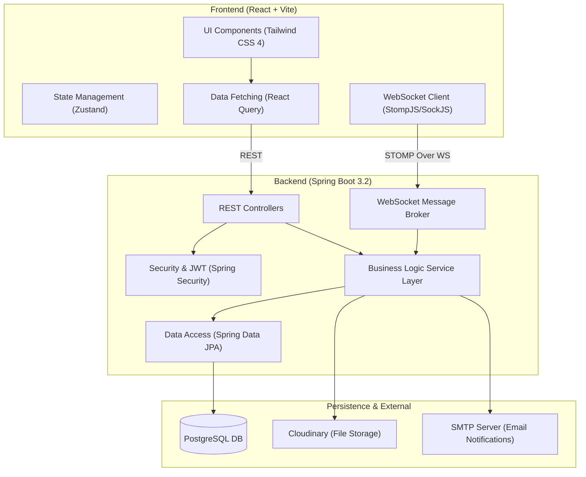
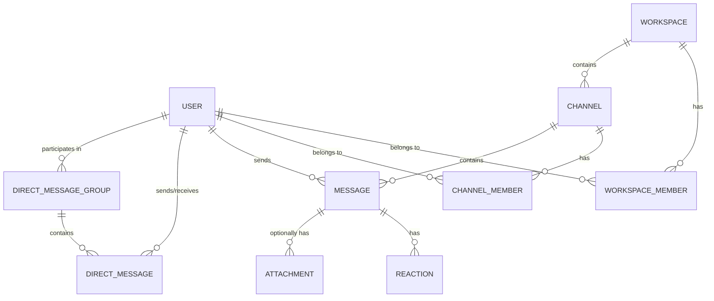
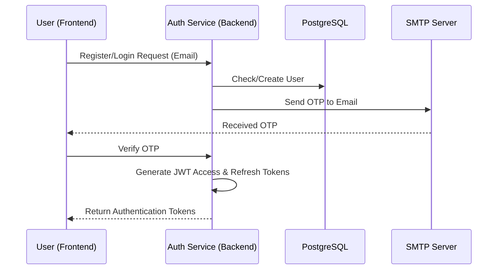
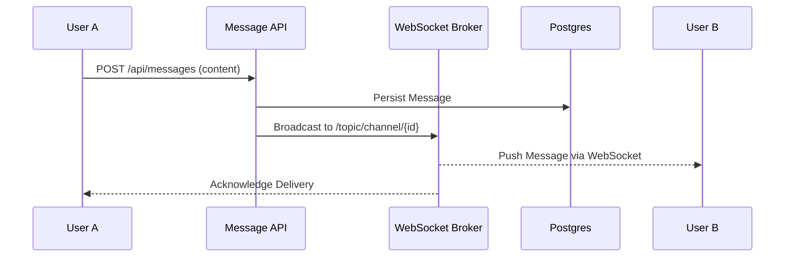

# ByteChat Architecture Overview

ByteChat is a full-stack real-time communication platform (Slack clone) built with a modern distributed architecture. It facilitates seamless collaboration through Workspaces, Channels, and Direct Messaging, powered by real-time updates and secure authentication.

## System Architecture

The application follows a classic Client-Server architecture with real-time bidirectional communication capabilities.

## Technology Stack

### Frontend
- **Framework**: [React](https://react.dev/) (Vite)
- **State Management**: [Zustand](https://zustand-demo.pmnd.rs/) (Lightweight store)
- **Data Fetching**: [Tanstack React Query](https://tanstack.com/query/latest) (Server-state management)
- **Styling**: [Tailwind CSS v4](https://tailwindcss.com/)
- **Real-time**: [SockJS](https://github.com/sockjs/sockjs-client) & [StompJS](https://stomp-js.github.io/stompjs/)
- **Icons**: [Lucide React](https://lucide.dev/)

### Backend
- **Framework**: [Spring Boot 3.2](https://spring.io/projects/spring-boot) (Java 21)
- **Security**: [Spring Security](https://spring.io/projects/spring-security) with JWT (Stateless)
- **Database**: [PostgreSQL](https://www.postgresql.org/) with [Spring Data JPA](https://spring.io/projects/spring-data-jpa)
- **Migrations**: [Flyway](https://flywaydb.org/)
- **Real-time**: [Spring WebSocket](https://docs.spring.io/spring-framework/docs/current/reference/html/web.html#websocket) (STOMP Broker)
- **File Storage**: [Cloudinary](https://cloudinary.com/)
- **Documentation**: [SpringDoc OpenAPI (Swagger)](https://springdoc.org/)

---

## Data Model (Core Entities)

The domain model is built around the concept of multi-tenant collaboration environments.

### Key Entities
| Entity | Description |
| :--- | :--- |
| **User** | Core identity, identifies users via email and handles profile data. |
| **Workspace** | High-level container for collaboration (e.g., Organization). |
| **Channel** | A specific topic/room within a Workspace. Can be public or private. |
| **Message** | The fundamental unit of chat. Belongs to a Channel or DM Group. |
| **Notification** | Tracks system alerts, mentions, and invitations. |

---

## Key User Flows

### 1. Authentication & Onboarding
ByteChat uses a secure, stateless JWT-based authentication flow.

### 2. Real-time Messaging
Messages are sent via REST but distributed via WebSocket for instant delivery.

### 3. Workspaces & Channels
Users can create and join workspaces, then navigate channels.

1. **Workspace Creation**: A user creates a workspace and becomes the **OWNER**.
2. **Invitations**: Owners can invite users via email.
3. **Channel Dynamics**: Users can join public channels or be invited to private ones.

### 4. Notifications & Presence
- **Presence**: Real-time tracking of online/offline status via WebSocket connection events.
- **Mentions**: When a user is tagged (@user), a Notification entity is created and pushed via their private `/user/topic/notifications` queue.
