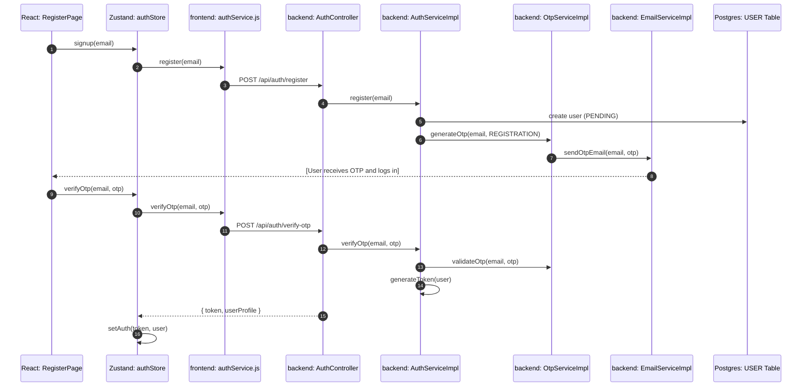
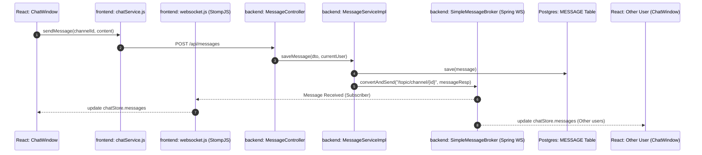
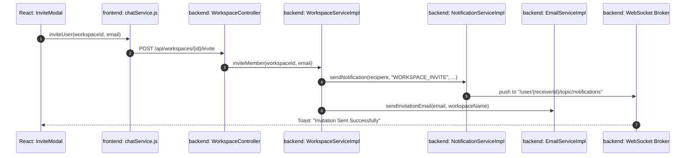
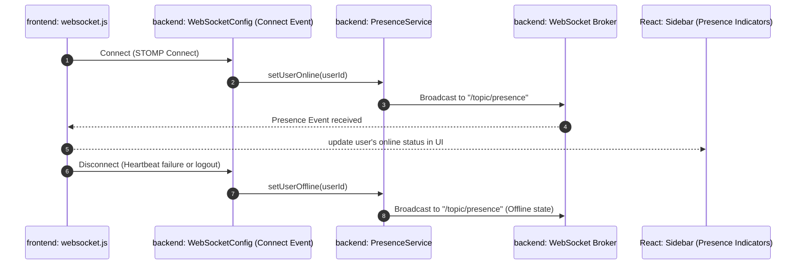

# ByteChat Detailed Architecture & Component Flows

This document details the exact class-level interaction and data flow for the key features of the ByteChat application.

## 1. Authentication & Registration Flow
ByteChat uses a dual-stage registration (OTP + JWT).

## 2. Real-time Messaging (Channel Chat)
Detailed flow of sending a channel message and the real-time broadcast via WebSocket.

## 3. Workspace Member Invitation Flow
How workspace owners invite collaborators and how they are notified.

## 4. Presence Tracking Flow
Tracking when users come online or go offline.

## Component Responsibility Matrix

| Component | Responsibility |
| :--- | :--- |
| `AuthController` | Entry point for login, registration, and OTP verification. |
| `AuthServiceImpl` | Handles token generation, security contexts, and account creation. |
| `MessageServiceImpl` | Core chat logic, persistent storage, and WebSocket distribution. |
| `WorkspaceServiceImpl` | Multi-tenancy management, permissions, and invitations. |
| `NotificationServiceImpl` | Real-time and persistent alerts (Invites, Mentions). |
| `chatStore.js` (Zustand) | Global state for current workspace, channels, and message lists. |
| `websocket.js` | Managing STOMP protocol connection and subscription state. |
| `api.js` (Axios) | Common interceptors for JWT injection and error handling. |
| `AppRouter.jsx` | Guarding routes, ensuring users are authenticated. |

## Detailed File Links
- **Backend Core**: [com.bytechat.serviceimpl](file:///d:/ByteChat/ByteChat/backend/src/main/java/com/bytechat/serviceimpl)
- **Frontend Logic**: [src/services](file:///d:/ByteChat/ByteChat/frontend/src/services)
- **State Layer**: [src/store](file:///d:/ByteChat/ByteChat/frontend/src/store)
